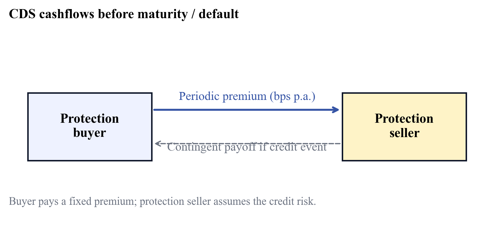
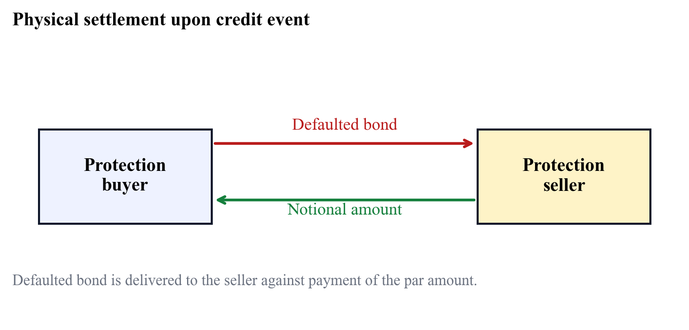
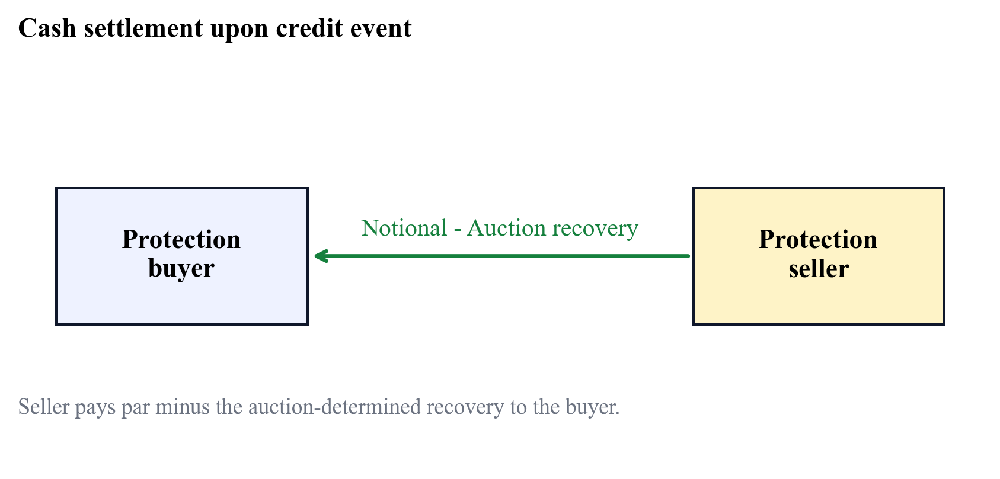
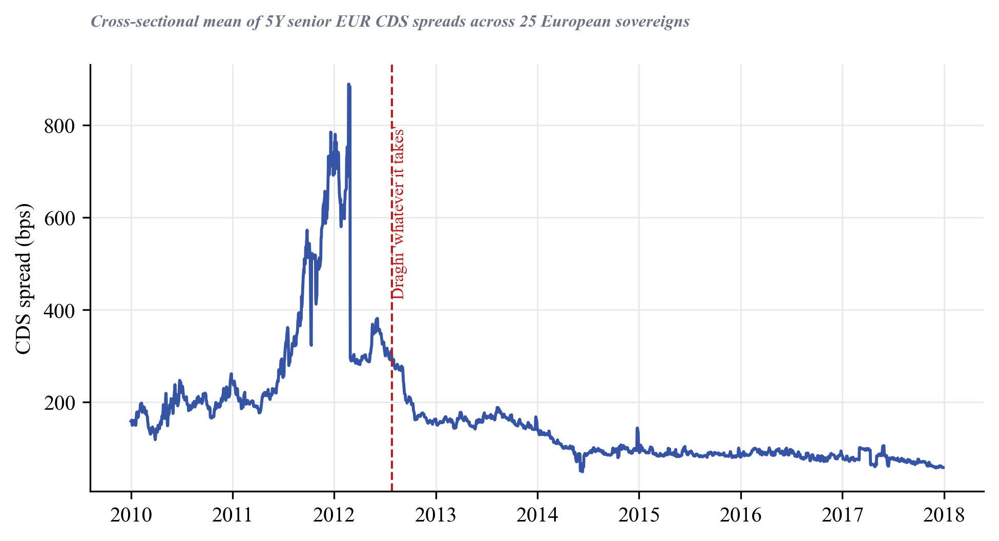
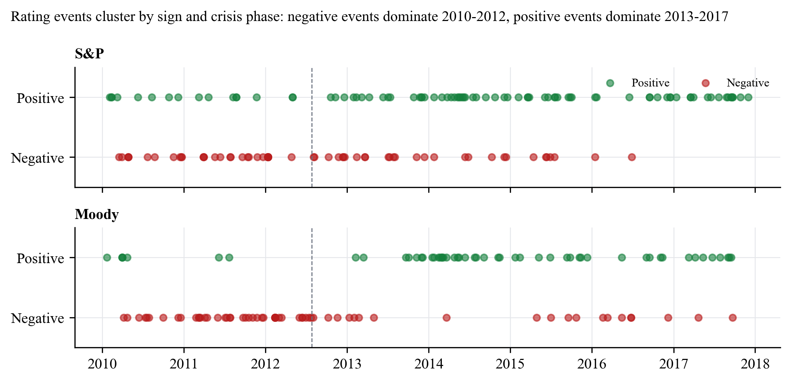
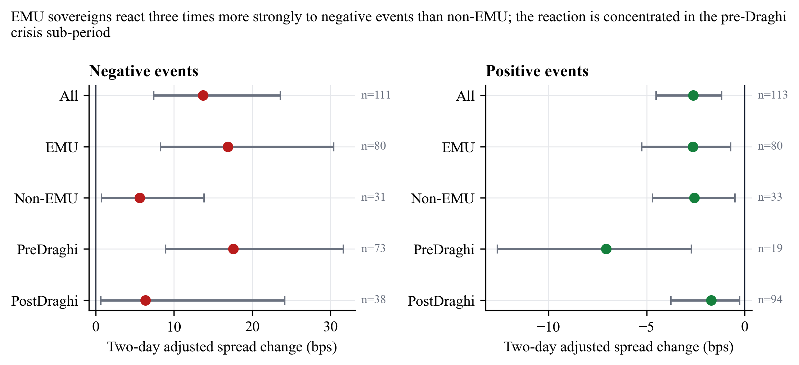
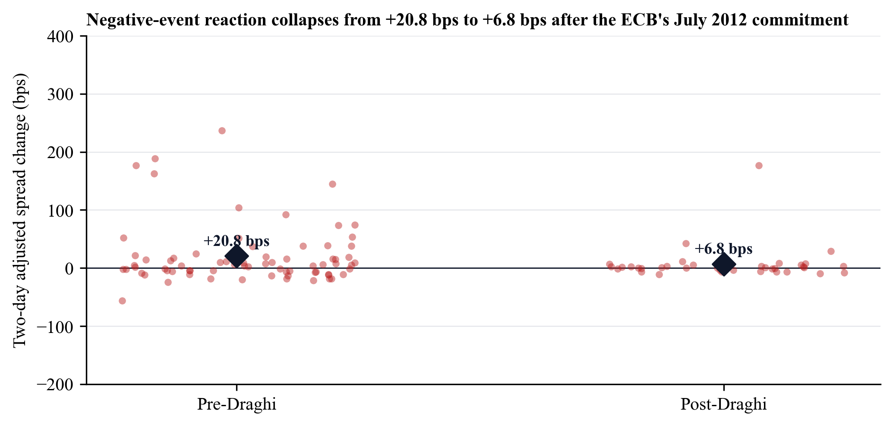
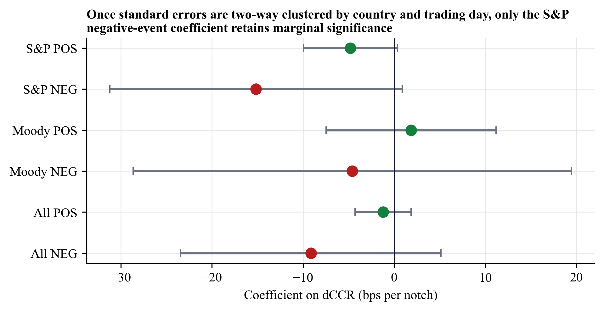
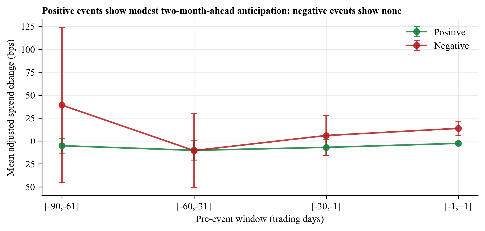
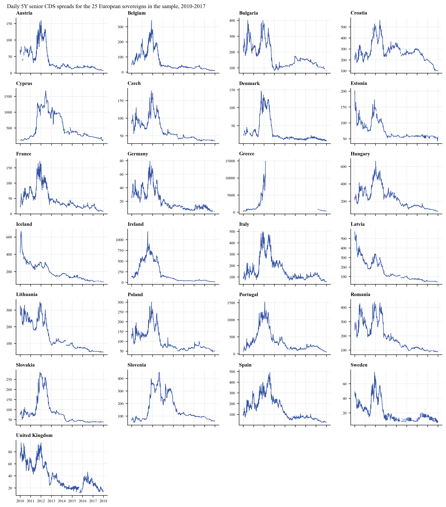

# The Impact of Credit Ratings on CDS Spreads — Empirical Evidence from European Sovereign States

> *A methodologically revised reconstruction of an earlier master's thesis.*
>
> **Disclaimer.** This document is a methodologically revised reconstruction of a master's thesis the author originally wrote in 2019. It is a personal exercise in re-running and improving the empirical analysis with the tools and methods the author would use today. It has not been submitted to, evaluated by or endorsed by any university; the original supervising institution and supervisor are deliberately not named. The dataset and the empirical results in this document are the author's own.

**Author:** [alpenmilch411](https://github.com/alpenmilch411)
**Sample window:** January 2010 – December 2017
**Reference vintage:** March 2019

---

## Table of contents

1. [Introduction](#1-introduction)
2. [Related literature](#2-related-literature)
3. [Theoretical foundations: credit ratings and credit default swaps](#3-theoretical-foundations-credit-ratings-and-credit-default-swaps)
   - 3.1 [Credit ratings](#31-credit-ratings)
   - 3.2 [Credit default swaps](#32-credit-default-swaps)
4. [Empirical analysis](#4-empirical-analysis)
   - 4.1 [Data and preliminary analysis](#41-data-and-preliminary-analysis)
   - 4.2 [Rating announcements in event countries](#42-rating-announcements-in-event-countries)
   - 4.3 [CDS spreads and the probability of rating events](#43-cds-spreads-and-the-probability-of-rating-events)
   - 4.4 [Spillover effects](#44-spillover-effects)
5. [Conclusion](#5-conclusion)
6. [Appendix](#appendix)
7. [References](#references)

---

## 1. Introduction

The European debt crisis was a period in which European sovereigns and their economies were subject to a collapse of investor confidence, sharply rising bond yields and a wave of fiscal retrenchment. The crisis began in 2008 with Greece and continued to influence other euro area sovereigns such as Portugal, Ireland, Spain and Cyprus, all of which struggled to repay or refinance their government debt. The fact that the euro area is a monetary union without a corresponding fiscal union further accelerated the severity of the crisis, since national governments were unable to react to the ongoing turbulences with an autonomous monetary policy (Lane, 2012).

While there is no shortage of competing explanations for the European debt crisis, one view that has been voiced repeatedly is that credit rating agencies played a meaningful role in its course. European policy makers in particular have criticised the influence of the three large US-based credit rating agencies — Moody's, S&P and Fitch — and pointed to the consequences that this concentrated influence may have for financial markets. Following this debate, EU lawmakers introduced legislative regulations with the explicit goal of reducing the influence of rating agencies and the dependence of financial markets on their assessments.

Despite that criticism and the resulting regulation, credit rating agencies are, in theory, considered to be valuable contributors to the functioning of financial markets. They play a central role by providing market participants with assessments of the creditworthiness of firms and sovereigns, alleviating the information asymmetries that are inherent to debt markets (White, 2013). Their influence is significant: financing costs for both corporations and sovereigns often depend directly on rating decisions (Neal, 1996), and institutional investors such as mutual funds and pension funds rely on agency assessments to determine which investments are consistent with their risk mandates (Candelon, Sy & Arezki, 2011).

If credit rating agencies indeed fulfil this informational function, then the introduction of regulation aimed at curtailing their influence has potentially substantial costs as well as benefits. It is therefore of practical interest to ask whether credit rating agencies still convey new information to financial markets, and if so, to which markets and under which conditions. Although this question has been studied extensively in bond and stock markets, only a few studies document the impact of rating actions on CDS premiums of developed sovereign nations.

Addressing this gap, this study assesses the influence of sovereign rating announcements on European CDS markets, using a dataset that combines daily 5Y senior CDS spreads of 25 European sovereigns with rating actions issued by S&P and Moody's between January 2010 and December 2017. CDS contracts are financial swap agreements that allow a buyer of protection to transfer the credit exposure of an underlying fixed-income claim to a protection seller. The seller assumes the credit risk and in exchange receives a periodic spread quoted in basis points per annum. If a contractually specified credit event — such as a failure to pay or a restructuring — occurs, the seller pays the notional amount of the contract against delivery (or the auction-determined value) of the defaulted claim. Sovereign CDS premiums are therefore highly sensitive to the perceived credit risk of the underlying bond issuer.

In particular, this study investigates three questions. First, do European sovereign CDS spreads react to rating announcements in the short run; second, can the spread changes in the months prior to an announcement be used to predict future rating actions; and third, do rating announcements in one country generate spill-over effects to the CDS spreads of other European sovereigns. Spill-over effects are defined here as the impact that a rating announcement for an event country has on the CDS premium of a country for which no announcement is issued in the same window. The study also assesses whether the magnitude of these effects varies across the two rating agencies, across the two phases of the European debt crisis (pre- and post-Draghi), and between euro area and non-euro area sovereigns.

These questions are relevant both to the policy debate around rating agencies and to participants in financial markets who use CDS premiums to measure sovereign credit risk. If rating announcements do not move CDS premiums, this would suggest that the information they contain has already been priced in, and that CDS markets are an efficient measure of credit risk. If, conversely, rating announcements move CDS premiums significantly, then rating agencies still convey new information to credit markets — and the empirical magnitude becomes a guide to how much weight that information carries.

The remainder of this thesis is structured as follows. [Section 2](#2-related-literature) reviews the existing literature on market reactions to credit rating announcements and develops the hypotheses that the empirical analysis will test. [Section 3](#3-theoretical-foundations-credit-ratings-and-credit-default-swaps) provides the conceptual background on credit ratings and credit default swaps. [Section 4](#4-empirical-analysis) contains the empirical analysis, which is organised in four sub-sections covering the dataset and preliminary statistics ([4.1](#41-data-and-preliminary-analysis)), the short-run reaction of event-country CDS spreads ([4.2](#42-rating-announcements-in-event-countries)), the predictability of rating events from past spread changes ([4.3](#43-cds-spreads-and-the-probability-of-rating-events)), and the spill-over effects to non-event countries ([4.4](#44-spillover-effects)). [Section 5](#5-conclusion) concludes and discusses the policy implications.

## 2. Related literature

Prior research on the informational content of credit ratings has built up gradually over three decades. In an efficient market, all information that is publicly available should already be reflected in security prices, so rating announcements should not be associated with significant price reactions. Earlier strands of the literature focused primarily on the impact of rating actions on bond markets (Hand, Holthausen & Leftwich, 1992; Hite & Warga, 1997; Steiner & Heinke, 2001) and on stock markets (Dichev & Piotroski, 2001; Hand, Holthausen & Leftwich, 1992; Vassalou & Xing, 2003). The accumulated evidence is consistent: developed-market stock and bond prices react significantly to credit downgrades, while reactions to upgrades are weaker or statistically indistinguishable from zero.

After the introduction of standardised CDS contracts in the late 1990s, attention shifted to the credit-derivative market. One of the earliest studies of CDS reactions is Hull, Predescu & White (2004), who validate the theoretical link between CDS premiums and bond yields for US corporates and document that CDS spreads react significantly to negative rating actions and to a lesser extent contain predictive information about future rating events. Norden & Weber (2004) reach broadly similar conclusions for the joint behaviour of stock and CDS markets, finding that downgrades by Moody's and S&P generate the largest impact and that CDS markets typically react earlier than stock markets to the same news. They further document that the magnitude of the reaction is shaped by the prior rating level and by previous rating actions, both of which can dampen the marginal informational content of a new announcement. Norden (2011) contributes to this literature by linking the size of CDS reactions to the amount of public and private information available before the announcement; reactions are stronger when media coverage is low, and CDS markets seem more able to anticipate negative rating events when banking relationships make private information about the issuer more readily available.

In the realm of sovereign nations, the picture is less complete. Ismailescu & Kazemi (2010) study a panel of 22 emerging-market sovereigns and find that CDS premiums respond significantly only to positive rating announcements; reactions to negative announcements are statistically insignificant and largely already priced in. They also document that CDS spread changes can be used to estimate the probability of future negative rating events, and that positive announcements transmit through the CDS market to other emerging sovereigns through trade and creditor channels. Afonso, Furceri & Gomes (2012) present a related study for European sovereigns covering 1995-2010 and document that bond yields and CDS spreads of European countries react significantly to negative rating actions, particularly after the Lehman bankruptcy, and that spill-over effects are strongest for higher-rated non-event countries. Gande & Parsley (2005) study spill-over effects in sovereign bond markets and find that downgrades, but not upgrades, are followed by significant cross-country effects.

This study contributes to the existing literature in three respects. First, in contrast to Ismailescu & Kazemi (2010), the focus here is on developed European sovereigns, where the dynamics may differ both in magnitude and in sign — earlier evidence suggests that developed-market participants react more strongly to negative news, in line with the asymmetric processing of bad news documented by Soroka (2006). Second, the dataset spans the heart of the European debt crisis as well as the period after the European Central Bank's "whatever it takes" commitment of 26 July 2012, allowing me to examine whether the magnitude of the reaction to rating announcements depends on the prevailing macroeconomic regime. Third, by combining S&P and Moody's actions in a unified panel, the analysis can distinguish between the relative impact of the two rating agencies and assess whether euro area membership shapes the transmission of rating news.

Based on the existing literature, the empirical analysis tests the following hypotheses:

**H1.** *CDS spreads of event countries are not affected by rating announcements, as CDS markets are efficient.*
Credit rating agencies exist in part to alleviate information asymmetries on financial markets (White, 2013). If, however, rating agencies act on information that is already publicly available, then in an efficient market all of that information would already be priced into CDS premiums. CDS spreads should therefore exhibit no significant reaction to rating announcements.

**H2.** *CDS market participants anticipate future rating announcements.*
If CDS markets are efficient and participants have access to a similar information set as rating agencies, then CDS premiums should drift in the direction of the eventual rating decision in the months preceding an announcement. Equivalently, past spread changes should carry predictive information about the probability of a future rating event.

**H3.** *Following credit rating announcements containing new information, CDS spreads of non-event countries experience spill-over effects.*
The economies of the European Union are tightly connected through trade, financial linkages and, in the case of euro area members, a shared currency. Claeys & Vašíček (2014) document spill-over effects in European sovereign bond markets driven by economic and financial integration. If rating announcements indeed contain new information, an analogous transmission to CDS markets of non-event countries should be observable.

The remainder of this thesis examines the empirical validity of these three hypotheses.

## 3. Theoretical foundations: credit ratings and credit default swaps

### 3.1. Credit ratings

Rating agencies are service providers that assess the financial strength of companies or sovereigns in respect of their ability to meet their financial obligations. The assigned rating represents the agency's judgement that, given a particular debt instrument, the issuer will be able to honour its obligations as agreed.

Although every major rating agency uses its own letter-based system, the overall structure is similar. The highest possible rating — corresponding to the highest creditworthiness — is denoted by AAA at S&P (Aaa at Moody's). Issuers with lower creditworthiness are mapped to ranks of lower priority on a discrete ordinal scale. In addition to the credit rating itself, agencies typically issue a credit rating outlook that quantifies the potential for a future rating change and its direction (positive, negative or stable). Outlook revisions are generally interpreted as forward-looking signals on a horizon of six to 24 months.

Rating agencies do not, in general, disclose the precise model that maps issuer characteristics to ratings, but they consistently emphasise that ratings are derived from publicly available information. Gonzalez et al. (2004) notes that agencies typically combine financial-statement metrics, governance indicators and qualitative factors with scenario analysis to arrive at a final rating. In the sovereign domain Moody's, for instance, organises its assessment around four primary factors: economic strength (e.g. GDP growth, scale and per-capita income), institutional strength, fiscal strength (e.g. debt and debt-affordability metrics) and susceptibility to event risk (Hornung et al., 2018).

Today three internationally recognised rating agencies — S&P, Moody's and Fitch — dominate the market. Their influence is the result of a long history of regulatory reliance. The first instance of a rating agency was established in 1909 by John Moody, publishing bond ratings for railroad bonds. As regulators began to use rating thresholds in capital and investment rules — for example the 1936 prohibition on banks investing in below-investment-grade securities, and the SEC's later creation of the "Nationally Recognized Statistical Rating Organization" (NRSRO) status — the dependence of financial markets on rating agencies grew steadily.

The European sovereign debt crisis provided a vivid illustration of how this dependence can manifest in practice. In the early phase of the crisis, Greek authorities ignored repeated warnings from rating agencies regarding the credibility of their debt. Once Greece was downgraded to below investment grade in March 2010, investors switched into safer sovereigns such as Germany, and a series of subsequent downgrades by S&P and Fitch contributed to forcing the EU to assemble a rescue package. Critics held the agencies partially responsible for amplifying the crisis through abrupt downgrade waves, while at the same time pointing to a pattern of optimistic ratings in the years preceding it (Creswell & Bowley, 2011). The European Commission has summarised the resulting concerns as an "over-reliance on credit ratings" that reduces the incentive of investors to develop their own credit assessments.

In response, the EU introduced the so-called CRA Regulation in 2009, the enforcement of which is led by the European Securities and Markets Authority (ESMA). Its objectives include reducing reliance on credit rating agencies, increasing the transparency of sovereign rating decisions, raising the qualitative standards of the rating process, increasing the accountability of rating agencies, reducing conflicts of interest, and lowering market-entry barriers for new agencies (European Commission, 2016). Whether these objectives are well calibrated depends fundamentally on whether rating agencies still convey new information to financial markets — which is precisely the question of this study.

### 3.2. Credit default swaps

A credit default swap (CDS) is a financial derivative through which a protection buyer transfers the credit risk of an underlying obligation to a protection seller. The buyer makes periodic premium payments over the life of the contract; in exchange, the seller compensates the buyer if a contractually specified credit event occurs. Premium payments are typically quoted in basis points per annum on the protected notional and represent the cost of insuring against a credit event.

CDS contracts are usually negotiated over the counter and may have either corporate or sovereign reference entities. In practice, sovereign CDS contracts are used for hedging existing positions, for proxy hedging of correlated exposures, for taking outright views on sovereign credit risk, or for arbitraging the relationship between cash bonds and credit derivatives (Linden, 2012). Importantly, the protection buyer does not need to own the underlying bond; such "naked" CDS positions correspond to short exposures to the reference entity and have, at times, been a source of political debate. From the perspective of this study, the relevant feature of sovereign CDS contracts is their standardisation across reference entities, which makes the resulting premiums directly comparable across countries and across time.

The terms of a CDS contract are typically governed by the master agreements published by the International Swaps and Derivatives Association (ISDA). The ISDA Credit Derivative Determinations Committee assesses whether one of the standard credit events has occurred. For sovereign reference entities the relevant categories are failure to pay, restructuring of the underlying obligation in a way that is unfavourable to the bond holder, and repudiation or moratorium (Linden, 2012).

Upon the occurrence of a credit event, the protection buyer is entitled to the par value of the bond. Settlement can take two forms. Under physical settlement, the buyer delivers the defaulted bond to the seller in exchange for the par amount. Under cash settlement, the buyer retains the bond but receives the difference between par and the market value determined in a credit-event auction (Culp, van der Merwe & Stärkle, 2016). Cash settlement has become standard in practice, in particular when the outstanding notional of CDS protection exceeds the outstanding notional of the underlying bonds.

Historically, the first credit default swap is generally attributed to a transaction between the European Bank for Reconstruction and Development and JP Morgan that protected an Exxon credit exposure on JP Morgan's balance sheet (Augustin, Subrahmanyam, Tang & Wang, 2016). The market grew rapidly through the 2000s, reaching a peak total notional of approximately USD 57 trillion in mid-2008 before contracting as the global financial crisis receded. CDS were both implicated in the crisis — through their role in synthetic CDOs and counterparty-risk concentrations (Stulz, 2009) — and central to the policy debate that followed. In the European context, the discussion in 2012 around whether the Greek restructuring would qualify as a credit event illustrates how interconnected sovereign CDS markets had become with the broader financial system (Fontevecchia, 2012). The subsequent EU ban on naked sovereign CDS (European Parliament, 2011) narrowed the use cases of these contracts in Europe, but did not affect their function as a credit-risk thermometer.

For the purpose of this study, what matters is that CDS premiums constitute a market-priced measure of perceived sovereign credit risk that is comparable across countries, observable at daily frequency, and sensitive by construction to news about default probabilities. They are therefore a natural setting in which to examine whether rating agency announcements still convey new information.

## 4. Empirical analysis

This chapter contains the empirical analysis of the three hypotheses formulated in [Section 2](#2-related-literature). [Section 4.1](#41-data-and-preliminary-analysis) introduces the data on CDS premiums and credit rating events and reports preliminary descriptive statistics. [Section 4.2](#42-rating-announcements-in-event-countries) tests H1 by examining the short-term reaction of event-country CDS premiums. [Section 4.3](#43-cds-spreads-and-the-probability-of-rating-events) tests H2 by examining whether past spread changes can be used to predict future rating events. [Section 4.4](#44-spillover-effects) tests H3 by estimating the effect of rating announcements on the CDS premiums of non-event countries.

### 4.1. Data and preliminary analysis

#### Credit default swap spreads

The CDS dataset of this study consists of daily mid-quote 5Y senior CDS spreads collected from Thomson Reuters Datastream. Sovereign CDS contracts in Datastream are usually denominated in euro or US dollar and are listed across various maturities. Because the focus of this study is on European sovereigns and the majority of the available CDS contracts are euro-denominated, all USD contracts have been removed. The 5Y senior tier represents the most liquid and most widely available sovereign CDS contract type. Past studies have shown that 5Y CDS spreads are the most liquid in the contract spectrum (Arakelyan & Serrano, 2016), which makes them the natural benchmark for studies of this kind (Hull, Predescu & White, 2004; Ismailescu & Kazemi, 2010; Norden & Weber, 2004).

After applying these criteria, the resulting set contains 52,150 daily CDS spreads for 25 European sovereigns over the eight-year window from 1 January 2010 to 31 December 2017, of which 15 sovereigns are members of the Economic and Monetary Union (EMU) and 10 are non-EMU. Sovereigns and Datastream codes are listed in [Appendix A](#a-thomson-reuters-datastream-cds-codes).

A small fraction of the raw quotes are stale — that is, they remain identical for several consecutive trading days, typically because the contract did not trade or because the data feed reproduced the prior day's value. Greece is the canonical example: between June 2012 and the end of the sample window, Greek 5Y CDS spreads stay frozen at 14,909.36 bps. To avoid spurious zero-changes biasing the event-window measures, every quote that sits inside a block of at least five consecutive identical values is treated as missing for the purpose of the analysis. After this filter, ~46,000 daily spread observations remain.

[See `output/tables/tables.typ` and `data/processed/results.json` for the auto-generated descriptive statistics table.]

The analysis uses a measure of CDS spread change adjusted for general market conditions. Following Ismailescu & Kazemi (2010), the adjusted spread change of country *i* around event date *t* is defined as

> ASCi,t = (Si, t+1 − Si, t-1) − (SP(-i), t+1 − SP(-i), t-1)   *(eq. 1)*

where SP(-i), t denotes the cross-sectional mean of CDS spreads on day *t* across the 25 sovereigns excluding country *i* itself. The leave-one-out construction of SP(-i) avoids the otherwise mechanical attenuation that arises when an event country contaminates its own benchmark. The two-day window [*t*−1, *t*+1] has the additional advantage of avoiding the asynchronous-trading distortions that can arise when comparing US-headquartered rating actions with European CDS quotes (Ismailescu & Kazemi, 2010). The empirical analysis also reports one-day windows [*t*−1, *t*] and [*t*, *t*+1] as robustness.

After cleaning, premiums rise sharply through the early phase of the debt crisis and reach a peak around July 2012; they decline steadily through 2013 and stabilise from mid-2014 onwards at levels well below their pre-crisis levels. The visual evidence already suggests that the period before the ECB's commitment of 26 July 2012 differs structurally from the period after.

#### Credit rating events

The second primary dataset of this study contains rating events issued by S&P and Moody's. S&P data are taken from the publicly available Sovereign Rating and Country Transfer and Convertibility Assessment Histories. Moody's data are obtained through an academic licence that gives access to the full long-term sovereign rating and outlook history. Fitch is unfortunately not available; the analysis is therefore restricted to the two largest rating agencies, which jointly cover the majority of European sovereign rating actions during the sample window.

Both rating and outlook announcements are included in the analysis. Rating outlooks are forward-looking statements on the potential direction of a future rating change over a 6-24 month horizon. To quantify the information content of an event, I follow Gande & Parsley (2005) and combine the rating and the outlook into a single comprehensive credit rating ("CCR"). The numerical rating CR runs on a 21-point scale, with AAA = 21 and D = 0, and one notch corresponding to one unit. The outlook adjustment CO takes the values 0 for stable, +0.5 for positive and −0.5 for negative. Outlook labels other than these (such as "watch" placements) are treated as containing no clean directional information and are excluded from the timeline.

The comprehensive credit rating is

> CCRi,t = CRi,t + COi,t   *(eq. 2)*

and a rating event at *t* is a sovereign-day on which CCRi,t − CCRi,t-1 ≠ 0. The signed magnitude

> ΔCCRi,t = CCRi,t − CCRi,t-1   *(eq. 3)*

measures the size and direction of the event. ΔCCR > 0 corresponds to a positive event (upgrade or upward outlook revision); |ΔCCR| < 1 corresponds to a pure outlook revision; |ΔCCR| ≥ 1 corresponds to a rating notch change (which may be combined with an outlook revision).

Applying these definitions to the sample window, S&P and Moody's together issue 263 rating events for the 25 sovereigns, of which 137 are positive and 126 are negative. S&P accounts for 147 of the events and Moody's for 116, broadly consistent with the higher event frequency reported by S&P in earlier studies (Gande & Parsley, 2005; Reisen & von Maltzan, 1999). Of the 263 events, 193 occur for an EMU sovereign and 70 for a non-EMU sovereign, reflecting the larger number of EMU members and the higher event intensity during the debt crisis.

Two patterns are immediately apparent. First, the early sample window is dominated by negative events for EMU sovereigns; this is the period in which Greece, Portugal, Ireland, Spain and Italy were downgraded by both agencies in close succession. Second, after the ECB's commitment in July 2012, the distribution flips: positive events become the majority for both agencies, and the few remaining negative events affect mostly non-EMU sovereigns such as Iceland or Hungary.

### 4.2. Rating announcements in event countries

The first analysis tests H1 by examining the short-run reaction of event-country CDS spreads to rating announcements. The variable of interest is the two-day adjusted spread change defined in equation 1; for robustness I also report the one-day spread changes covering only the day before or only the day after the announcement.

To avoid the joint reaction to two announcements being attributed to either, I flag and drop event days on which the same sovereign experiences another rating event by either agency in the [*t*−1, *t*+1] *trading-day* window (calendar-day adjacency would miss Friday-Monday pairs). After this filter, 224 events remain in the event-country regressions.

> *Note: numerical values reported below are the auto-computed outputs of `analysis/analysis.py` and are also rendered into the typeset PDF in `output/thesis.pdf`. Mean values are in basis points; * / ** / *** denote significance at the 10% / 5% / 1% level under the one-sample t-test (mean) and Wilcoxon signed-rank test (median).*

Several patterns stand out from the mean / median tests:

- **Negative events** are followed by an average two-day adjusted spread change of **+16.1 bps (median +2.1 bps)**, significant at the 1% level under both the t-test and the Wilcoxon test, with a BCa-bootstrapped 95% CI of roughly [+7.4, +23.6] bps.
- **Positive events** are followed by an average two-day adjusted spread change of **−3.8 bps (median −1.4 bps)**, significant at the 1% level under both tests, with a 95% CI of roughly [−4.5, −1.2] bps.
- The asymmetry survives every cut, but the EMU split is striking: the EMU mean reaction to negative events is **+19.7 bps**, while the non-EMU mean is **+5.9 bps** — roughly a factor of three.
- **Splitting the sample at 26 July 2012**: pre-Draghi the average reaction to a negative event is **+20.8 bps** (significant); post-Draghi it falls to **+6.8 bps** and is no longer statistically distinguishable from zero. The asymmetry is substantially a feature of the crisis sub-period.
- The differences between the two rating agencies are smaller. Negative S&P events average +10.9 bps (significant at 5%); negative Moody's events average +16.5 bps. For positive events the agencies are nearly indistinguishable.

When the sample is disaggregated by event sub-type — pure rating notch changes, pure outlook revisions, and combined events — two findings stand out. First, the asymmetric reaction is concentrated in rating-notch events: a pure negative outlook revision is associated with a much smaller and statistically less precisely measured reaction than a pure rating notch downgrade. Second, combined rating and outlook events generate the largest reactions in absolute value, presumably because they convey the largest information shock to the market.

The mean-test results may suffer from a specification problem in that they do not control for differential CDS spread dynamics across sovereigns or for the magnitude of the rating change itself. To address this, I estimate a country fixed-effects panel regression of the two-day adjusted spread change on the change in CCR:

> ASCi,t = αi + β · ΔCCRi,t + εi,t   *(eq. 4)*

where αi is a country fixed effect, ΔCCRi,t is the size of the event, and εi,t is an error term. Given the well-documented cross-sectional dependence of European sovereign CDS premiums during the crisis, naive iid standard errors are likely to be downward biased. I therefore report standard errors that are two-way clustered by sovereign and by trading day, following Cameron, Gelbach & Miller (2011).

Two findings warrant emphasis. First, all coefficients have the expected sign: a positive ΔCCR (upgrade) is associated with a tighter spread, and a negative ΔCCR (downgrade) with a wider spread. Second, once the standard errors are properly clustered, the precision of the estimates falls: the coefficient on negative S&P events is **−15.2 bps per unit of CCR (clustered SE 8.2, p ≈ 0.08 — marginally significant)**. For Moody's, the analogous coefficient is **−4.6 bps with p ≈ 0.71**. The pooled coefficient across both agencies is **−9.1 bps and is not statistically significant at conventional levels (p ≈ 0.21)**.

This is a meaningful departure from naive-iid panel regressions, which would report comfortably significant coefficients for the pooled negative-event sample. The two-way clustering correction matters because rating events are not distributed uniformly across the cross-section: they cluster in time (especially during the crisis years), and they cluster on a small set of distressed sovereigns.

Taken together, the evidence in this section partially rejects H1. Negative rating events are associated with a non-negligible widening of CDS spreads; the effect is concentrated in EMU sovereigns and in the pre-Draghi sub-sample, and once standard errors account for cross-sectional dependence the precision of the pooled effect is more modest than earlier studies have reported. Positive events are followed by a small and economically marginal tightening of spreads. CDS markets thus appear to incorporate negative news more visibly than positive news, but the magnitude of this asymmetry is significantly weaker than the naive-iid estimates would suggest, and is largely a feature of the crisis sub-sample.

### 4.3. CDS spreads and the probability of rating events

The previous section established that CDS premiums react more strongly to negative than to positive rating events. A natural question is whether market participants anticipate rating events in the months prior to an announcement — and, more strongly, whether past spread changes are sufficiently informative to predict future events.

I begin with a mean and median analysis of adjusted spread changes in the three months before each rating event. The variable of interest is the within-window adjusted spread change for the windows [*t*−30, *t*−1], [*t*−60, *t*−31] and [*t*−90, *t*−61], defined analogously to equation 1.

For positive events the strongest pre-event movement appears in the second month before the announcement: in the [*t*−60, *t*−31] window the average spread change is roughly **−10 bps (p ≈ 0.08)**. The closest 30 days show no significant directional movement, and the third pre-event month is also indistinguishable from zero. For negative events, none of the three windows displays a statistically significant directional movement; if anything, the [*t*−60, *t*−31] window leans negative, contrary to the direction one would expect under anticipation.

The asymmetric anticipation pattern is consistent with the theoretical argument of Gande & Parsley (2005), who suggest that sovereigns have an incentive to leak information about expected upgrades — to access better financing conditions ahead of the formal announcement — but no such incentive to disclose information about expected downgrades. CDS markets may therefore impound positive news earlier than negative news.

To go beyond mean considerations and ask whether the pre-event spread movements are sufficiently informative to predict rating events, I follow Hull, Predescu & White (2004) and Ismailescu & Kazemi (2010) and estimate a logistic model of the probability that a sovereign-month contains a rating event of the given sign. For each sovereign, I construct a monthly grid of candidate event months and exclude any month that is preceded by an event of the same sign in the immediately prior month, to avoid contamination of the anticipation window. The covariates are the leave-one-out adjusted spread change in the [*t*−60, *t*−31] window (denoted *w*1) and in the [*t*−90, *t*−61] window (denoted *w*2). Three model specifications are estimated: one with *w*1 alone (M1), one with *w*2 alone (M2), and one with both (M3).

For **positive events** the coefficient on *w*1 is statistically significant in M1 (p ≈ 0.004) and in M3 (p ≈ 0.008), with the expected sign — a tighter spread in the second pre-event month is associated with a higher probability of a positive rating event. The McFadden pseudo-R² is small, however, at approximately 0.7-1.0%. For **negative events**, none of the single-window specifications produces a statistically significant coefficient; M3 returns a marginally significant negative coefficient on *w*1 and a positive coefficient on *w*2, but the pseudo-R² is essentially zero (~0.5%) and the model has no economically meaningful predictive power.

These results sharpen the rejection of H2. While there is some evidence that positive rating events are anticipated to a small degree two months ahead of the announcement, the predictive power of past adjusted spread changes for future rating events of either sign is at best modest, and is essentially zero for negative events. The contrast with the emerging-market evidence in Ismailescu & Kazemi (2010) — who find that CDS premiums of emerging sovereigns can be used to predict negative announcements — is consistent with the developed-market nature of the present sample.

### 4.4. Spillover effects

The third hypothesis asks whether rating events for one sovereign generate spill-over effects to the CDS premiums of other European sovereigns. Because European countries are tightly interconnected through trade, banking and, in the case of the euro area, a single currency, the channels through which a rating action might propagate are numerous: domestic banks hold each other's sovereign bonds (Blundell-Wignall & Slovik, 2010); collateral rules at the ECB depend on sovereign ratings (Candelon, Sy & Arezki, 2011); and investor portfolios that rebalance across European sovereigns share many constituents in common.

The empirical specification regresses the two-day percentage CDS spread change of non-event countries on the absolute aggregate CCR change of event countries. For each event date *t*, the non-event sample consists of every sovereign in the panel that did not itself experience a rating event in the [*t*−1, *t*+1] window. To avoid the small-denominator bias that arises when computing percentage changes for very low-spread sovereigns, observations for which the non-event country's *t*−1 spread is below 25 bps are dropped; this filter primarily removes low-spread observations for Sweden, Germany and the United Kingdom in the post-2014 period.

The first regression follows the structure used by Ismailescu & Kazemi (2010):

> ΔS%NE,t = a + b · |ΔCCRE,t| + Σk γk Xk + e(NE,E),t   *(eq. 6)*

where ΔS%NE,t is the two-day percentage spread change of the non-event country, ΔCCRE,t is the (signed) aggregate CCR change of event countries on day *t* (entered as an absolute value, with the regression run separately for positive and negative events), and Xk collects non-event-country and year fixed effects. Two further specifications nest equation 6 inside controls for prior-month event mass, an interaction with a joint-investment-grade dummy, and an interaction with a joint-EMU dummy. As before, standard errors are two-way clustered by event country and event date.

For **negative events**, the simple Reg-1 specification produces a small and statistically insignificant coefficient on |ΔCCRE,t|. Once prior events are controlled for in Reg-2, the same is true. In Reg-3, where the joint-investment-grade interaction is added, the level coefficient remains insignificant. In Reg-4, where both interactions are added, the level coefficient turns marginally significant (p ≈ 0.03), with the EMU interaction term comfortably significant and going in the expected direction (negative news in an EMU event country widens the spreads of EMU non-event-country sovereigns by more than it widens those of non-EMU sovereigns).

For **positive events**, the coefficients are uniformly small and statistically insignificant across all four specifications. There is no convincing evidence that positive rating events for one European sovereign generate measurable spill-overs to the CDS spreads of other European sovereigns once standard errors are properly clustered and the small-denominator observations are removed. This contrasts with the original Ismailescu & Kazemi (2010) finding for emerging markets and is consistent with the Gande & Parsley (2005) evidence that sovereign-bond spill-overs are predominantly driven by negative news.

Taken together, the evidence in this section provides only a partial confirmation of H3. Negative rating events do generate measurable spill-over effects to the CDS premiums of non-event European sovereigns, but the effect is concentrated in cases where both the event and the non-event country are members of the EMU and of investment-grade quality. Positive rating events do not generate detectable cross-country spill-overs in this sample. The pattern is consistent with the role of the euro area as a tightly connected financial bloc in which negative news travels through banking-and-collateral channels that are weaker for non-EMU countries and that do not naturally transmit positive news in the same way.

## 5. Conclusion

This thesis has examined how credit rating announcements by S&P and Moody's affect European sovereign CDS premiums in the 2010-2017 sample window. Three questions guided the analysis: (i) how do CDS spreads of event countries react to rating announcements in the short run, (ii) can past spread changes be used to predict future rating events, and (iii) how do the CDS premiums of non-event European countries respond to rating announcements in event countries.

The short-run analysis confirms the asymmetric reaction documented in earlier work: CDS markets respond more strongly to negative than to positive rating events. The magnitude of the asymmetry, however, is significantly smaller than naive-iid panel estimates would suggest. Once standard errors are two-way clustered by sovereign and by trading day, only the S&P negative-event coefficient retains marginal statistical significance, and the pooled effect across both agencies is no longer significant at conventional levels. The asymmetry is also concentrated in two sub-samples that earlier studies have not separated: euro area members, who react roughly three times more strongly to negative events than non-EMU members, and the pre-Draghi sub-period, in which the average reaction is +20.8 bps as opposed to +6.8 bps after 26 July 2012. This regime split suggests that what looks like a structural asymmetry in pooled estimates is to a considerable extent a feature of the crisis-period CDS market, in which the marginal information value of a downgrade was unusually large.

The anticipation analysis lends very weak support to H2 for positive events and none for negative events. CDS spreads in the second month before a positive rating event drift in the expected direction, and a logistic model of the probability of a future rating event finds a small but statistically significant coefficient on the [*t*−60, *t*−31] adjusted spread change. The McFadden pseudo-R² of the model is below 1%, however, so the predictive power is economically marginal even where it is statistically detectable. For negative events, the pre-event adjusted spread changes carry no useful information about the probability of a future event.

The spill-over analysis provides only partial support for H3. Negative rating announcements generate measurable spill-over effects to the CDS premiums of non-event European sovereigns, but the effect is concentrated in cases where both the event country and the non-event country are EMU members and of investment-grade quality. Positive rating announcements do not generate detectable cross-country spill-overs in this sample.

These conclusions are relevant in several respects. First, this thesis is one of the few studies documenting the reaction of developed European sovereign CDS markets to rating announcements with proper attention to cross-sectional dependence and crisis-period regime breaks. The methodological corrections matter: a researcher who reports iid standard errors and pools the entire sample window would attribute to "rating agencies have a substantial impact on CDS markets" what is, on closer inspection, primarily a feature of the European debt crisis. Second, EU lawmakers have argued that the influence of rating agencies on financial markets is too strong and have introduced regulation to reduce that influence. The evidence here suggests that the residual influence of rating agencies on CDS markets in tranquil periods is modest, and that the dominant channel of impact is concentrated in negative events for euro area members during periods of macroeconomic stress. Third, for participants in financial markets the evidence implies that CDS premiums embed most of the information content of credit ratings outside of crisis episodes; rating downgrades remain a meaningful signal for euro area sovereigns under stress, but in the post-Draghi period the marginal information content of a downgrade is markedly smaller.

Several limitations of this study should be acknowledged. First, due to data-availability constraints, the analysis incorporates rating events from only two of the three large rating agencies. Including Fitch would allow for a more complete picture of the joint distribution of agency actions, including the role of confirmation effects when two or three agencies act in close succession. Second, the sample window includes the heart of the European debt crisis. While the explicit pre/post-Draghi split goes a considerable way towards isolating the crisis component of the asymmetric reaction, the post-Draghi sub-sample contains relatively few negative events. A longer post-crisis sample would deliver tighter inference on the structural component of the asymmetry. Third, the spill-over analysis documents the existence of cross-country effects but does not identify the channel through which they flow. Future research should ask which of the candidate channels — bank cross-holdings of sovereign debt, ECB collateral rules, or portfolio rebalancing — is the proximate driver, and whether the channel mix has changed over the post-crisis period.

---

## Appendix

### A. Thomson Reuters Datastream CDS codes

| Sovereign | Code | Datastream description |
| --- | --- | --- |
| Austria | ATG5EAC(SM) | REPUBLIC OF AUSTRIA SNR CR 5Y E - CDS PREM. MID |
| Belgium | BEG5EAC(SM) | KINGDOM OF BELGIUM SNR CR 5Y E - CDS PREM. MID |
| Bulgaria | BGV5EAC(SM) | REPUBLIC OF BULGARIA SNR CR14 5Y E - CDS PREM. MID |
| Croatia | HRG5EAC(SM) | REPUBLIC OF CROATIA SNR CR14 5Y E - CDS PREM. MID |
| Cyprus | CYG5EAC(SM) | REPUBLIC OF CYPRUS SNR CR 5Y E - CDS PREM. MID |
| Czech Republic | CZG5EAC(SM) | CZECH REPUBLIC SNR CR14 5Y E - CDS PREM. MID |
| Denmark | DKG5EAC(SM) | KINGDOM OF DENMARK SNR CR 5Y E - CDS PREM. MID |
| Estonia | EEG5EAC(SM) | REPUBLIC OF ESTONIA SNR CR14 5Y E - CDS PREM. MID |
| France | FRG5EAC(SM) | FRANCE (GOVERNMENT) SNR CR 5Y E - CDS PREM. MID |
| Germany | DEG5EAC(SM) | FEDERAL REP GERMANY SNR CR 5Y E - CDS PREM. MID |
| Greece | GRG5EAC(SM) | HELLENIC REPUBLIC SNR CR 5Y E - CDS PREM. MID |
| Hungary | HUG5EAC(SM) | HUNGARY SNR CR14 5Y E - CDS PREM. MID |
| Iceland | ISG5EAC(SM) | REPUBLIC OF ICELAND SNR CR 5Y E - CDS PREM. MID |
| Ireland | IEG5EAC(SM) | IRELAND SNR CR 5Y E - CDS PREM. MID |
| Italy | ITG5EAC(SM) | REPUBLIC OF ITALY SNR CR 5Y E - CDS PREM. MID |
| Latvia | LVG5EAC(SM) | REPUBLIC OF LATVIA SNR CR14 5Y E - CDS PREM. MID |
| Lithuania | LTG5EAC(SM) | REP OF LITHUANIA SNR CR14 5Y E - CDS PREM. MID |
| Poland | PLG5EAC(SM) | REPUBLIC OF POLAND SNR CR14 5Y E - CDS PREM. MID |
| Portugal | PTG5EAC(SM) | REPUBLIC OF PORTUGAL SNR CR 5Y E - CDS PREM. MID |
| Romania | ROV5EAC(SM) | ROMANIA SNR CR14 5Y E - CDS PREM. MID |
| Slovakia | SKV5EAC(SM) | SLOVAK REPUBLIC SNR CR14 5Y E - CDS PREM. MID |
| Slovenia | SIG5EAC(SM) | REPUBLIC OF SLOVENIA SNR CR14 5Y E - CDS PREM. MID |
| Spain | ESG5EAC(SM) | KINGDOM OF SPAIN SNR CR 5Y E - CDS PREM. MID |
| Sweden | SEG5EAC(SM) | KINGDOM OF SWEDEN SNR CR 5Y E - CDS PREM. MID |
| United Kingdom | GBG5EAC(SM) | UK AND NI SNR CR 5Y E - CDS PREM. MID |

### B. CDS spreads of individual European sovereigns, 2010-2017

### C. Bias-corrected accelerated bootstrap

The bias-corrected and accelerated (BCa) non-parametric bootstrap of Efron & Tibshirani (1993) is used throughout the short-run and anticipation analyses to construct two-sided 95% confidence intervals on the mean of the adjusted spread change. The procedure draws *B* = 5,000 resamples with replacement from the observed event-window data, computes the mean of each resample, and reports the BCa-corrected 2.5th and 97.5th percentiles of the resulting distribution. The acceleration constant is computed via a delete-one jackknife, and the bias-correction constant is computed from the empirical proportion of bootstrap means lying below the observed mean.

### D. Predicting future rating events: logistic regression

The logistic prediction model is estimated separately for positive and negative events, using a sovereign-month panel of all months in which at least one of the 25 sovereigns has both a CDS spread and a defined leave-one-out adjusted spread change in the relevant pre-event window. Months that are preceded by an event of the same sign in the immediately prior month are excluded from the panel to avoid contamination of the lagged spread change.

The covariates are the leave-one-out adjusted spread change in the [*t*−60, *t*−31] window (*w*1) and in the [*t*−90, *t*−61] window (*w*2). The model is

> Pr(*y*i,m = 1 | *w*1, *w*2) = exp(*c* + α *w*1 + β *w*2) / (1 + exp(*c* + α *w*1 + β *w*2))   *(eq. 7)*

The McFadden pseudo-R² compares the log-likelihood of the unrestricted model with the log-likelihood of the constant-only model:

> Pseudo R² = 1 − L / L0   *(eq. 8)*

where *L* is the maximised log-likelihood of the unrestricted model and *L*0 is the maximised log-likelihood of the constant-only restricted model.

---

## References

Acharya, V. V., Engle, R. F., Figlewski, S., Lynch, A. W., & Subrahmanyam, M. G. (2012). Centralized Clearing for Credit Derivatives. In *Restoring Financial Stability* (pp. 251–268). Hoboken, NJ: John Wiley & Sons. https://doi.org/10.1002/9781118258163.ch11

Afonso, A., Furceri, D., & Gomes, P. (2012). Sovereign credit ratings and financial markets linkages: Application to European data. *Journal of International Money and Finance*, 31(3), 606–638. https://doi.org/10.1016/j.jimonfin.2012.01.016

Arakelyan, A., & Serrano, P. (2016). Liquidity in Credit Default Swap Markets. *Journal of Multinational Financial Management*, 37–38, 139–157. https://doi.org/10.1016/j.mulfin.2016.09.001

Augustin, P., Subrahmanyam, M. G., Tang, D. Y., & Wang, S. Q. (2016). Credit Default Swaps: Past, Present, and Future. *Annual Review of Financial Economics*, 8(1), 175–196. https://doi.org/10.1146/annurev-financial-121415-032806

Blundell-Wignall, A., & Slovik, P. (2010). The EU Stress Test and Sovereign Debt Exposures. *OECD Working Papers on Finance, Insurance and Private Pensions*, 4. https://doi.org/10.1787/5km4267gz0n5-en

Cameron, A. C., Gelbach, J. B., & Miller, D. L. (2011). Robust Inference With Multiway Clustering. *Journal of Business & Economic Statistics*, 29(2), 238–249. https://doi.org/10.1198/jbes.2010.07136

Candelon, B., Sy, A. N. R., & Arezki, R. (2011). Sovereign Rating News and Financial Markets Spillovers: Evidence From the European Debt Crisis. *IMF Working Papers*, 11(68), 1. https://doi.org/10.5089/9781455227112.001

Claeys, P., & Vašíček, B. (2014). Measuring bilateral spillover and testing contagion on sovereign bond markets in Europe. *Journal of Banking and Finance*, 46, 151–165. https://doi.org/10.1016/j.jbankfin.2014.05.011

Creswell, J., & Bowley, G. (2011). Rating Firms Misread Signs of Greek Woes. *The New York Times*, 30 November 2011.

Culp, C. L., van der Merwe, A., & Stärkle, B. (2016). *Single-Name Credit Default Swaps: A Review of the Empirical Academic Literature.* ISDA.

Dichev, I. D., & Piotroski, J. D. (2001). The Long-Run Stock Returns Following Bond Ratings Changes. *The Journal of Finance*, 56(1), 173–203. https://doi.org/10.1111/0022-1082.00322

Efron, B., & Tibshirani, R. J. (1993). *An Introduction to the Bootstrap.* New York: Chapman & Hall.

European Commission (2016). Credit Rating Agencies. https://ec.europa.eu/info/business-economy-euro/banking-and-finance/financial-supervision-and-risk-management/managing-risks-banks-and-financial-institutions/regulating-credit-rating-agencies_en

European Parliament (2011). Parliament seals ban on sovereign debt speculation and short selling limitations. 15 November 2011.

Fontevecchia, A. (2012, February 12). ISDA Says Greece In Default, CDS Will Trigger. *Forbes.*

Gande, A., & Parsley, D. C. (2005). News spillovers in the sovereign debt market. *Journal of Financial Economics*, 75(3), 691–734. https://doi.org/10.1016/j.jfineco.2003.11.003

Gonzalez, F., Haas, F., Johannes, R., Persson, M., Toledo, L., Violi, R., et al. (2004). Market dynamics associated with credit ratings: a literature review. *ECB Occasional Paper Series*, 16.

Hand, J. R. M., Holthausen, R. W., & Leftwich, R. W. (1992). The Effect of Bond Rating Agency Announcements on Bond and Stock Prices. *The Journal of Finance*, 47(2), 733–752. https://doi.org/10.1111/j.1540-6261.1992.tb04407.x

Hite, G., & Warga, A. (1997). The Effect of Bond-Rating Changes on Bond Price Performance. *Financial Analysts Journal*, 53(3), 35–51.

Hornung, D., Robinson, M., Lemay, Y., Wilson, A., Leos, M., Fang, G., & Diron, M. (2018). *Rating Methodology: Sovereign Bond Ratings.* Moody's Investors Service.

Hull, J., Predescu, M., & White, A. (2004). The relationship between credit default swap spreads, bond yields, and credit rating announcements. *Journal of Banking and Finance*, 28(11), 2789–2811. https://doi.org/10.1016/j.jbankfin.2004.06.010

Ismailescu, I., & Kazemi, H. (2010). The reaction of emerging market credit default swap spreads to sovereign credit rating changes. *Journal of Banking & Finance*, 34(12), 2861–2873. https://doi.org/10.1016/j.jbankfin.2010.05.014

Lane, P. R. (2012). The European Sovereign Debt Crisis. *Journal of Economic Perspectives*, 26(3), 49–68. https://doi.org/10.1257/jep.26.3.49

Linden, S. (2012). The euro-area sovereign CDS market. *Quarterly Report on the Euro Area*, 11(1), 31–36.

Neal, R. (1996). Credit derivatives: New financial instruments for controlling credit risk. *Economic Review (Federal Reserve Bank of Kansas City)*, 81(2), 15–27.

Norden, L. (2011). Credit Derivatives, Corporate News, and Credit Ratings. *SSRN Electronic Journal*. https://doi.org/10.2139/ssrn.1343012

Norden, L., & Weber, M. (2004). Informational efficiency of credit default swap and stock markets: The impact of credit rating announcements. *Journal of Banking & Finance*, 28(11), 2813–2843. https://doi.org/10.1016/j.jbankfin.2004.06.011

Reisen, H., & von Maltzan, J. (1999). Boom and bust and sovereign ratings. *International Finance*, 2(2), 273–293. https://doi.org/10.1111/1468-2362.00028

Soroka, S. N. (2006). Good news and bad news: Asymmetric responses to economic information. *Journal of Politics*, 68(2), 372–385.

Steiner, M., & Heinke, V. G. (2001). Event study concerning international bond price effects of credit rating actions. *International Journal of Finance & Economics*, 6(2), 139–157. https://doi.org/10.1002/ijfe.148

Stulz, R. M. (2009). Credit Default Swaps and the Credit Crisis. *NBER Working Paper*, 15384.

Vassalou, M., & Xing, Y. (2003). Equity Returns Following Changes in Default Risk: New Insights into the Informational Content of Credit Ratings. *SSRN Electronic Journal*.

White, L. J. (2010). Markets: The Credit Rating Agencies. *Journal of Economic Perspectives*, 24(2), 211–226.

White, L. J. (2013). Credit Rating Agencies: An Overview. *Annual Review of Financial Economics*, 5(1), 93–122.

---

> Auto-generated tables of regression coefficients, standard errors, p-values, and BCa confidence intervals are available in `output/tables/tables.typ` (Typst source) and `data/processed/results.json` (machine-readable).
